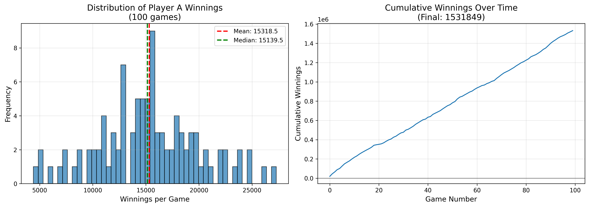

# reference-2-2026
Second reference bot 2026

This bot (written in `python_good_cards`) implements the same tossing strategy as [the first reference bot](https://pkr.bot/refbot1), but a raising strategy which takes advantage of high hole cards generally leading to better performance. Running 100 games against the default skeleton bot got the following score distribution: 

As we can see, this bot beats the skeleton by quite a wide margin, and never lost in the 100 games we ran above.
